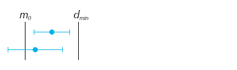
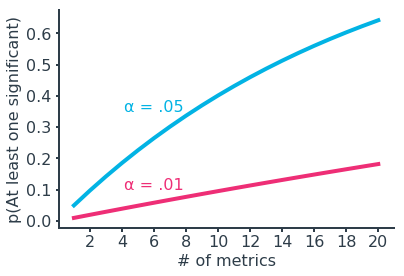

# Part 10. Experimental Design & Recommendation Engines

## Part 10-1: Experimental Design

 ### 1. Concepts of Experiment Design
   > Learn about what it means to run an experiment, and how this differs from observational studies. Topics include not only what to include in an experimental design, but also what to watch out for when designing an experiment.    Correlation does not imply causation. To deduce causality, we should run an experiment.

   1. What is an Experiment?
      * Based on the level control over features
        * High: An **experiment** is defined by comparing outcomes between two or more groups, and ensuring equivalence between the compared groups _except_ for the manipulation that we want to test. 

        * Low or none: **Observational studies** or **naturalistic or correlational studies** are used when we have no control over the features. This often comes up in medical studies, where no control is exerted on the variables of interest due to ethical concerns. Due to the lack of control over the variables, we typically cannot infer causality in an observational study.

        * Some: **Quasi-experiment** is an experiment with some control over features. When all three features of an experiment is hard to be met, then the quasi-experiment can be applied. While a quasi-experiment may not have the same strength of causality inference as a true experiment, the results can still provide a strong amount of evidence for the relationship being investigated. The relaxation of requirements makes the quasi-experiment more flexible and easier to set up.
      
      * Key features of an experiment: 
        * Comparison between groups
        * Control other variables
        * Equivalence between groups, which is typically carried out through some kind of randomization procedure. It is used to assign a **unit of analysis**, a entity under study (eg. a user or a page view).
        
   2. Types of Experiment
      * Between-subjects experiment (A/B test): An experiment comparing the performance of two (or more) groups:
        * Control group (Group A), a group without any manipulation
        * Experimental group (Group B), a group exposed to the feature or environment we want to test on

      * Within-subjects designs: An experiment where each unit of analysis (or a participant) is exposed to multple conditions
        * Also known as repeated measures designs
        * While participants of a between-subjects experiment is exposed to one condition, within-subjects experiment's participants experience all conditions.
        * Randomization still has a part here in the order in which individuals complete conditions. This is important to reduce potential bias effects.

      * Factorial designs: A experiment which manipulates the value of multiple features of interest. 
        * Example: With two independent manipulations "X" and "Y", we have four conditions: "control", "X only", "Y only", "X and Y". 
        * Experimental designs where multiple features are manipulated simultaneously are more frequently seen in engineering and physical sciences domains, where the system units tend to be under stricter control. They're less seen in the social and medical realms, where individual differences can impede experiment creation and analysis.

   3. Types of Sampling
      * Goal: Use a subset of the whole population to make inferences about the full population.

      * Simple random sampling: All members of the population have an equal chance of being selected.
        * We can expect the feature distribution of selected units to be similar to the distribution of the population as a whole. (Representing the whole population)
        * This is simple and easy to set up.

      * Stratified random sampling: Divide population into distinct subgroups or strata, then sample from each subgroup.
        * In a _proportional sample_ approach, the sample size is proportional to how large the group is in the full population. This approach guarantees a certain level of knowledge from each subset, and theoretically a more representative overall inference on the population.
        * In a _nonproportional sample_ approach, we simply sample the same size of sample from each group. This requires weighting each group separately, but this extra effort offers a higher understanding of each subgroup in a deeper investigation.

      * Non-probabilistic sampling: More simplified sampling process, at the risk of harming the validity of your results.
        * _Convenience sample_ records information from readily available units. (e.g. Studies at colleges using only college students' records and the prediction made by magazine "The Literary Digest" on the 1936 U.S. presidential election (Alf Landon vs. Franklin D. Roosevelt))

   4. Measuring Outcomes
      * Evaluation metrics: Features that provide an objective measure of the success of an experimental manipulation
        * `Construct` as analogous to the goal or objective under investigation; and  `operational definition` as the way outcomes are measured.
        * `Key results (KRs)` or `key performance indicators (KPIs)` also serve a similar purpose as study goals and evaluation metrics, and might even be driving factors in the creation of an experiment.
        * We hope to see a difference between groups that will tell us if our manipulation was a success.
        * Consider the goals of a study separate from the evaluation metrics is recommended for the following reasons:
          * This makes it clear that the metric isn't the main point of a study: it's the _implications_ of the metric relative to the goal that matters. This is especially important if a metric isn't directly attached to the goal. 
          * Having the metric separate from the goal can clarify the purpose of conducting the study or experiment. It makes sure we can answer the question of why we want to run a study or experiment.
      
      * Invariant metrics: Metrics that objectively check for equivalence between experimental groups 
        * Metrics in this category serve to check that the experiment is running as expected. We hope these will not be different between groups.

   5. Creating Metrics
      * Funnel: A path or steps taken by a user from the start of their experience to the desired destination state. Typically, the funnel ends at the place where your main evaluation metric is recorded, and includes a step where your experimental manipulation can be performed. 
        * Properties: 
          * Typically there will be some dropoff in the users that move from step to step.
          * The flow through a funnel might be idealized compared to actual user practice.

      * Unit of diversion: Observational unit by which users are split into experimental groups.
        * Event-based diversion(e.g. pageview): Each time a user loads up the page of interest, the experimental condition is randomly rolled. Since this ignores previous visits, this can create an inconsistent experience, if the condition causes a user-visible change.
        * Cookie-based diversion: A cookie is stored on the user's device, which determines their experimental condition as long as the cookie remains on the device. Cookies don't require a user to have an account or be logged in, but can be subverted through anonymous browsing or a user just clearing out cookies.
        * Account-based diversion(e.g. User ID): User IDs are randomly divided into conditions. Account-based diversions are reliable, but requires users to have accounts and be logged in. This means that our pool of data might be limited in scope, and you'll need to consider the risks of using personally-identifiable information.

   6. Controlling Variables
      * To determine causality between features, we need to: 
        * Enact the manipulation on one of the features of interest so that we know that it is causing the change in the other feature.
        * Make sure that all other features are accounted for.

      * Confounding variables: Unaccounted-for variables that interact with variables of interest

   7. Checking Validity
      * Experimental validity: Degree to which your experiment actually accomplishes the conclusions you state

      * Construct validity: Degree to which an experiment's objective metric results support the _goals of the study_ (how goals are aligned to the evaluation metrics you use)

      * Internal validity: Degree to which an experiment's claims of _causality_ can be supported (degree to which a causal relationship can be derived from an experiment's results)
        * Controlling for and accounting for other variables is key

      * External validity: Degree to which an experiment's results can be _generalized to cases outside of the experiment_
        * Most relevant with experiments that involve sampling

   8. Checking Bias
      * Experimental bias: Systematic errors that affect the interpretation of results, mostly in terms of internal validity

      * Sampling bias: Error stemming from observations not being representative of the population
        * Self-selection bias
          * The types of people that respond (to a survey) might be qualitatively very different from those that do not.
          * Mitigation: _Weighting responses_ based on the differences between the observed responses and properties of the target may be needed to come to reasonable conclusions.
        * Survivorship bias
          * Losses or dropouts of observed units is not accounted for in an analysis

      * Novelty bias: Error stemming from change in participant behavior solely due to novel stimuli
        * Important for cases where we want to track changes over time, while this is probably not a concern when it comes to manipulations that are expected to only have a one-shot effect.

      * Order biases: Errors stemming from condition order, whether they occur first (primacy bias) or last (recency bias)
        * Primacy effect: Related novelty (or anchoring), refers to the changes due to condition beings _first_ in the order. This affects early conditions, perhaps biasing them to be recalled better or to serve as anchor values for later conditions.
        * Recency effect: the changes due to condition beings _last_ in the order. This affects later conditions, perhaps causing bias due to being fresher in memory or task fatigue.
        * Important when running a within-subjects experiment, which each participant is exposed to multiple experimental conditions.
        * Mitigation: _Randomize_ the order of conditions. While there still might end up being order effects like _carry-over effects_, where a particular condition continues to have an effect on future conditions, this will be much easier to detect than if every participant completed the task in the exact same order of conditions.

      * Experimenter bias: Errors stemming from change in participant behavior due to the presence or knowledge of the experimenter
        * Important in face-to-face experiments
        * Experimenter might subtly nudge the participant towards their expected result.    Participants may act differently in the presence of an experimenter, to try and act in the 'right' way – regardless of if a subject _actually_ knows what the experimenter is looking for or not.
        * Mitigation: Blinding (the administrator or the participant do not know the condition being used) or double-blind design (hiding condition information from both administrator and participant)

      * [Other biases](https://en.wikipedia.org/wiki/List_of_cognitive_biases)

   9. Ethics in Experimentation
      * Minimize participant risk: Experimenters are obligated to construct experiments that minimize the risks to participants in the study. Risk of harm isn't just in the physical sense, but also the mental sense. If an experimental condition has potential to negatively affect a participant's emotions or mentality, then it's worth thinking about if the risks are really necessary to perform the desired investigation.

      * Have clear benefits for risks taken: In some cases, risks may be unavoidable, and so they must be weighed against the benefits that may come from performing the study. When expectations for the study are not clearly defined, this throws into question the purpose of exposing subjects to risk. However, if the benefits are shown to be worth the risks, then it is still possible for the study to be run. This often comes up in medicine, where test treatments should show worthy potential against alternative approaches.

      * Provide informed consent: Building up somewhat from the previous two points, subjects should be informed of and agree to the risks and benefits of participation before they join the study or experiment. This is also an opportunity for a participant to opt out of participation. However, there are some cases where deception is necessary. This might be to avoid biasing the participant's behavior by seeding their expectations, or if there is a dummy task surrounding the actual test to be performed. In cases like this, it's important to include a debriefing after the subject's participation so that they don't come away from the task feeling mislead.

      * Handle sensitive data appropriately: If you're dealing with identifiable information in your study, make sure that you take appropriate steps to protect their anonymity from others. Sensitive information includes things like names, addresses, pictures, timestamps, and other links from personal identifiers to account information and history. Collected data should be anonymized as much as possible; surveys and census results are often also aggregated to avoid tracing outcomes back to any one person.

      * Informed consent for web-based experiments: Opt-out / opt-in approaches

   10. A SMART Mnemonic for Experiments
       * _Specific_: Make sure the goals of your experiment are specific.
       * _Measurable_: Outcomes must be measurable using objective metrics
       * _Achievable_: The steps taken for the experiment and the goals must be realistic.
       * _Relevant_: The experiment needs to have purpose behind it.
       * _Timely_: Results must be obtainable in a reasonable time frame.
       * Considerations of ethical issues or bias will need to be considered separately

 ### 2. Statistical Considerations in Testing
   > Learn about statistical techniques and considerations used when evaluating the data collected during an experiment. It is expected that you come into the course with knowledge about inferential statistics; the content here will see you applying that knowledge in different ways.

   1. Statistical Significance
      * p-value

   2. Practical Significance
      * Definition: The level of observed change required to deploy a tested experimental manipulation     
        cf. m_0: the null statistic value / d_min: the practical significance bound / blue line: confindence interval
      * Case 1) Confidence interval is fully in practical significance region.    
        The experimental manipulation can be concluded to have a statistically and practically significant effect.    
          
      * Case 2) Confidence interval completely excludes any part of practical significance region.    
        If the confidence interval does not include any values that would be considered practically significant, this is a clear case for us to not implement the experimental change. This includes the case where the metric is statistically significant, but whose interval does not extend past the practical significance bounds.    
          
      * Case 3) Confidence interval includes points both inside and outside practical significance bounds    
        In each of these cases, there is an uncertain possibility of practical significance being achieved. In an ideal world, you would be able to collect more data to reduce our uncertainty, reducing the scenario to one of the previous cases. Outside of this, you'll need to consider the risks carefully in order to make a recommendation on whether or not to follow through with a tested change. Your analysis might also reveal subsets of the population or aspects of the manipulation that do work, in order to refine further studies or experiments.    
          

   3. Experiment Size
      * Statistical power: Given a true mean (different from the null), the probability of rejecting the null hypothesis.

   4. Using Dummy Tests
      * Dummy test: Also called A/A test, an experiment run between equivalent groups (i.e. no experimental group)
      * Benefits
        * Check if an experiment is implemented correctly: A dummy test can expose if there are any errors in the randomization or assignment procedures.
        * Collect information about metrics' behaviors: If historic data is not enough to predict the outcome of recorded metrics or allow for experiment duration to be computed, then a dummy test can be useful for getting baselines.
      * Limitation: Time consuming
        * Mitigation: A/A/B test or a hybrid test. That is, we split the data into three groups: two control and one experimental. A comparison between control groups can be used to learn about null-environment properties before making inferences on the effect of the experimental manipulation.

   5. Non-Parametric Tests
      * Non-parametric test: An alternative to standard tests, in case if there is an uncertainty about the true variability of a metric's distribution, a lack of data to assume normality, or wanting to do inference on a statistic that lacks a standard test. This can be used as a second check on your experimental results.
      * Benefits
        * The test don't rely on many assumptions of the underlying population, and so can be used in a wider range of circumstances.
      * Resampling involved
        * Bootstrapping
        * Permutation tests
      * No resampling involved (performing the test only on the data present)
        * Rank-sum test (Mann-Whitney): Also known as the Mann-Whitney U test, is not a test of any particular statistic, like the mean or median. Instead, it's a test of distributions. 
        * Sign test: It only requires that there be paired values between two groups to compare, and tests whether one group's values tend to be higher than the other's. In the sign test, we don't care how large differences are between groups, only which group takes a larger value. It's most useful when we have very few observations to draw from and can't make a good assumption of underlying distribution characteristics. 

   6. Analyzing Multiple Metrics
      * How likely are we to falsely declare some kind of significant effect if we have two metrics, each set up with a 5% Type I error rate? (You can input your response as a decimal or as a percentage.)
        * p(both not significant) = 0.95 * 0.95 = 0.9025
        * p(at least one significant) = 1 - 0.9025 = 0.0975 (answer)
        * For n independent evaluation metrics, seeing one with a statistically significant result would be enough to call the manipulation a success. In this case, the probability of making at least one Type I error is given by $\alpha_{over} = 1 - (1 - \alpha_{ind})^n$   
        

      * Bonferroni correction: Divide overall error rate (alpha) by the number of comparisons to be made  
        $\alpha_{ind} = \alpha_{over} / n$
      * Šidák correction: $\alpha_{ind} = 1 - (1 - \alpha_{over})^(1/n)$   
        
   
   7. Early Stopping
      * To account for the early stopping settings, the experiment should be designed ahead of any data collection.
      * For continuous tracking: [Sequential A/B testing](https://www.evanmiller.org/sequential-ab-testing.html), [sequential probability ratio test](https://en.wikipedia.org/wiki/Sequential_probability_ratio_test)

 ### 3. A/B Testing Case Study

## Part 10-2: Recommendation Engines

 ### 1. Introduction to Recommendation Engines
   > Learn about the main ideas associated with recommendation engines. This includes techniques and measures of effectiveness.

 ### 2. Matrix Factorization for Recommendations
   > Learn about one of the most popular techniques for recommendation engines known as FunkSVD. You will also complete a class that brings together a number of techniques to make recommendations for a number of different scenarios.

