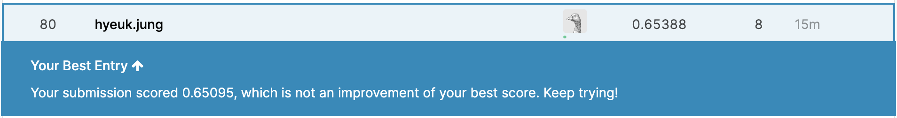

# Capstone Project: Create a Customer Segmentation Report for Arvato Financial Services
> Goal: Use unsupervised learning techniques to perform customer segmentation. Then use supervised learning techniques to develop models which predict which individuals are most likely to convert into becoming customers for the company. <br>


## Table of Contents
- [Project Overview](#overview)
- [Software Requirements](#software)
- [File Descriptions](#hierarchy)
- [Project Components](#components)
  - [Data Analysis and Preprocessing](#data_analysis)
  - [Unsupervised Learning Models](#unsupervised_learning)
  - [Supervised Learning Models](#supervised_learning)
  - [Kaggle Competition](#kaggle_competition)
- [Conclusion](#conclusion)
- [Credits and Acknowledgements](#credits)

<a id='overview'></a>

## 1. Project Overview
In this project, unsupervised and supervised learning methods are used to analyze customers data to build a model that predicts potential customers of a mail-order sales company in Germany. The data was provided by Arvato Financial Solutions, a Bertelsman subsidiary company. 

First, customer segmentation was done by applying unsupervised learning techniques, specifically `Principal Component Analysis (PCA)` and `K-Means Clustering` methods. Comparison between the customers and the general population was done to uncover the demographic characteristics of the core customers.

Then, using another dataset from a marketing campaign of the company and applying supervised learning techniques, I built models to predict individuals that are most likely to be the potential customer of the company. To evaluate the model, `Area Under Curve (AUC)` for the ROC curve was used.

Finally, I participated in a Kaggle competition to evaluate the supervised learning model.


<a id='software'></a>

## 2. Software Requirements (Installation)
  For detailed information, check `requirement.txt`
  * Anaconda distribution of Python (Python 3.6x or above)
  * scikit-learn
  * xgboost
  * lightgbm
  
  
<a id='hierarchy'></a>

## 3. File Descriptions
  Due to the sensitive nature of dataset, it is not made publicly available to the general public.
  ```
  - models_and_results # pickled models and prediction results

  - Arvato Project Workbook.html
  - Arvato Project Workbook.ipynb
  - README.md
  - requirement.txt
  ```


<a id='components'></a>

## 4. Project Components

<a id='data_analysis'></a>

###  4.1. Data Analysis and Preprocessing
This part refers to `Part 0: Get to Know the Data` in the jupyter notebook. 
  * Load the `azdias`, demographics data for the general population of Germany, and `customers` dataset, demographics data for customers of a mail-order company.
  * Using attributes information provided, deal with missing or unknown values
  * Drop columns based on the three conditions:
    * Features not described in the attributes information
    * Check the proportion of missing values by columns and drop features (columns) with more than 30% missing values
    * Check the correlation among features and drop columns with 90% or higher correlations
  * Check the proportion of missing values by rows and drop rows with more than 20% missing values
  * Drop extra columns to match the features between `azdias` and `customers` datasets.
  * Re-encode mixed and categorical features
    * Find numerical, categorical, ordinal, and mixed type columns using the description datasets provided: To find numerical types, I used `numerical` as a keyword, `type, typology, typification, classification, CAMEO, flag` for categorical types, and assumed others as ordinal and mixed types.
    * Split information in the mixed type columns: After exploring the result, I was able to find `PRAEGENDE_JUGENDJAHRE` holds two different information: decades and movement. Each information was extracted and separately stored in the dataset.
    * Transform to categorical variables: Instead of creating dummy variables, I decided transform object type columns only. At this stage, I have only two object type columns `CAMEO_DEU_2015` and `OST_WEST_KZ`. 
  * Filling missing values and scaling
    * Fill in missing values with `mode` value: To apply PCA, missing values needs to be filled. As the majority of variable type is either categorical or ordinal, I decided to use `mode` instead of using other descriptive values such as `median` or `mean`.
    * Scale each column using standard scaler: Scaling is needed to prevent few variables dominating in the model.

<a id='unsupervised_learning'></a>

###  4.2. Unsupervised Learning Models
This part refers to `Part 1: Customer Segmentation Report` in the jupyter notebook. 
  * Use `Principal Component Analysis (PCA)` to reduce the dimension and select the number of features needed to explain about 80% of the total variance
  * Apply `K-Means clustering` to the PCA-transformed dataset and find the demographic characteristics of the core customers

<a id='supervised_learning'></a>

###  4.3. Supervised Learning Models
This part refers to `Part 2: Supervised Learning Model` in the jupyter notebook. 
  * Develop prediction models using the following classification methods:
    * Logistic Regression 
    * Random Forest 
    * AdaBoost
    * Gradient Boosting
    * XGBoost
    * LightBGM 
  * Use `GridSearchCV` and `Bayesian Optimization` to try multiple combinations of parameters to find the optimal model
  * Use `Area Under Curve (AUC)` for the ROC curve to evaluate the models

<a id='kaggle_competition'></a>

###  4.4 Kaggle Competition
This part refers to `Part 3: Kaggle Competition` in the jupyter notebook.  <br>Here, with the optimal model I found in the previous step, I predicted which individuals are most likely to respond to a mailout campaign and tested that model through Kaggle. 


<a id='conclusion'></a>

## 5. Conclusion
After testing the performance of several models based on cross-validation result, I used `Gradient Boosting Classifier`, and trained the model by using a `Bayesian Optimization` method. Finally, I submitted the result to Kaggle competition and achieved a 0.65388 roc_auc_score. (XGBoost's AUC = 0.65095)

  

The detailed explanation and results can be found at the post available [here](https://medium.com/@hyeukjung213/kaggle-competition-identification-of-customer-segments-and-finding-potential-customers-of-93b73271bdc0).


<a id='credits'></a>

## 6. Credits and Acknowledgements
  1. [Udacity](https://www.udacity.com/)
  2. Proejct data: [Arvato Financial Solutions](https://finance.arvato.com/en-us//)
  3. [Kaggle](https://www.kaggle.com/c/udacity-arvato-identify-customers/data)

